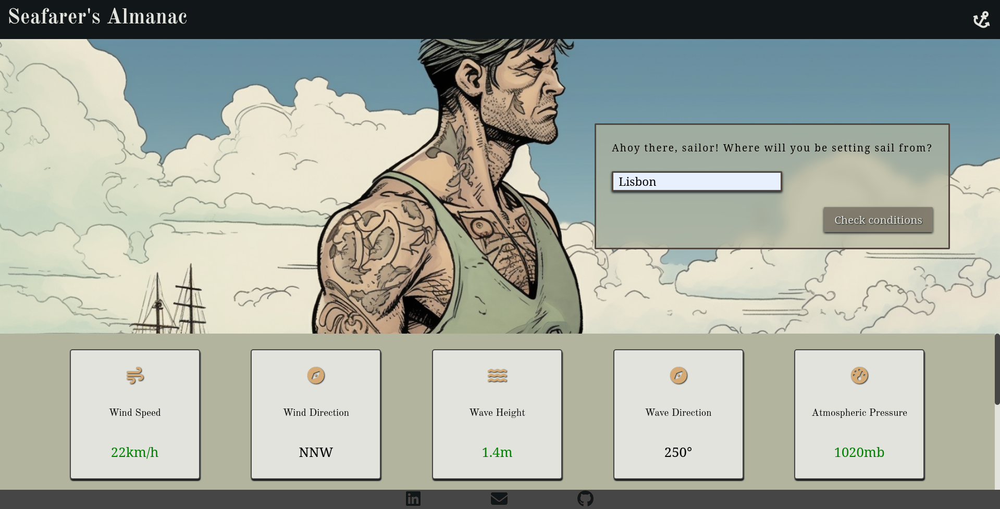

# Seafarer's Almanac
Seafarer's Almanac is an application built using **JS**, **HTML**, and **CSS**, designed to provide weather conditions specifically for sailing purposes.
The application retrieves weather data from [WeatherAPI](https://www.weatherapi.com/) based on the user's provided location. It offers essential parameters including wind speed, wind direction, temperature, precipitation, wave height, wave direction, UV index, atmospheric pressure, and cloud coverage.
Code is bundled using **Webpack**.
Background images were generated using [Midjourney](https://www.midjourney.com/).

## Features
- Accurate and up-to-date weather information for sailing.
- User-friendly interface.
- Retrieves data from WeatherAPI.
- Displays essential weather parameters:
    - Wind speed
    - Wind direction
    - Temperature
    - Precipitation
    - Wave height
    - Wave direction
    - UV index
    - Atmospheric pressure
    - Cloud coverage

## Preview

## Credits
Anchor icon by [Icons8](https://icons8.com/icon/l5eJ4WAxXAQG/anchor)

**Thank you for visiting my GitHub profile!**